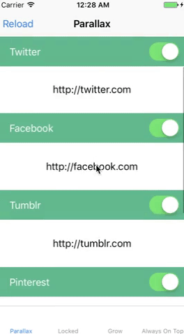
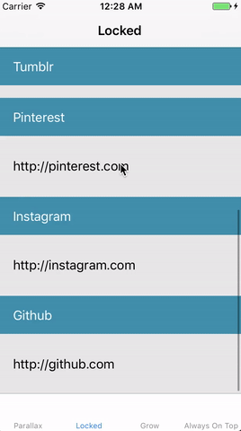
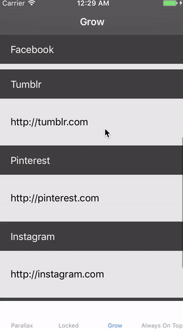
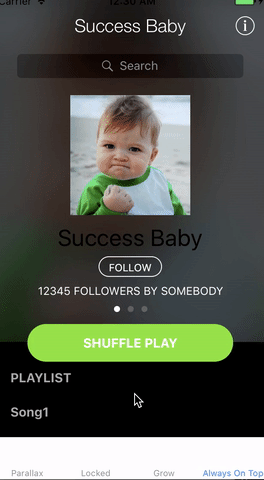

## CSStickyFlowLayoutHeaders

This project was inspired by [CSStickyHeaderFlowLayout](https://github.com/CSStickyHeaderFlowLayout/CSStickyHeaderFlowLayout). 
Here you can find a swift translation of both - layout and examples. Just build and check it out.

Types of headers which you can find here:

Parallax header:



Sticky header:



Growing header:



AlwaysOnTop header:



## Installation:

Just move CSStickyHeaderFlowLayout.swift and CSStickyHeaderFlowLayoutAttributes.swift into your project then configure constraints using one of the examples.

You may also need to make CSStickyHeaderFlowLayout your collectionView layout. You can do that in viewDidLoad:

```
    private var layout : CSStickyHeaderFlowLayout? {
        return self.collectionView?.collectionViewLayout as? CSStickyHeaderFlowLayout
    }

    override func viewDidLoad() {
        super.viewDidLoad()

        let headerNib = UINib(nibName: "CSParallaxHeader", bundle: nil)
        self.collectionView?.register(headerNib, forSupplementaryViewOfKind: CSStickyHeaderParallaxHeader, withReuseIdentifier: "header")
        
        self.layout?.parallaxHeaderReferenceSize = CGSize(width: self.view.frame.size.width, height: 100)
    }
```

